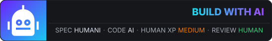
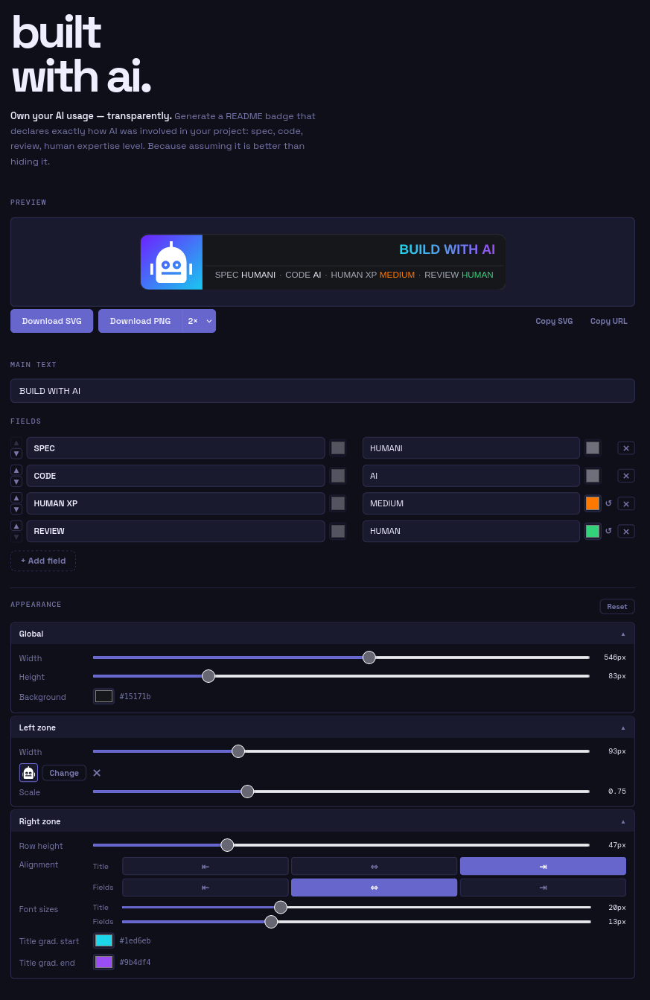

# built with ai.

**Own your AI usage — transparently.**

Generate a README badge that declares exactly how AI was involved in your
project: spec, code, review, human expertise level. Because assuming it is
better than hiding it.



---

## Why?

Developers are using AI every day. Some hide it. This badge is for those who
don't — who believe **transparency about AI usage is a sign of maturity**, not
weakness.

**[Open the generator →](https://badele.github.io/build-with-ai/)**

Declare your context openly:

| Field             | Example value | Meaning                                     |
| ----------------- | ------------- | ------------------------------------------- |
| `SPEC`            | `HUMAN+AI`    | Specification written collaboratively       |
| `CODE`            | `AI`          | Code generated by AI, supervised by a human |
| `REVIEW`          | `HUMAN`       | Code reviewed by a human                    |
| `HUMAN EXPERTISE` | `HIGH`        | Senior engineer in the loop                 |

The badge is a self-contained SVG — no external fonts, no JavaScript — and
renders correctly on GitHub README pages.

---

## Usage

### 1. Design your badge

Open the generator, customize everything: text, fields, colors, left-zone icon,
font sizes, alignment. The full configuration lives in the URL.



### 2. Download and commit

Click **"Download SVG"** (or **"Copy SVG"**) and commit the file to your
repository.

### 3. Embed the badge in your README

```markdown

```

---

## Local development

```bash
# Start the dev server
just dev
# → http://localhost:5173

# Run tests
just test

# Build for production
just build
```

---

## In memory of Pierre Vannier

This project is dedicated to
[Pierre Vannier](https://www.linkedin.com/in/pierrevannier/), CEO of
[Flint](https://flint.sh/), who passed away in 2026.

Pierre fought to make sense of AI's rapid rise, its consequences for society,
for work, and for what it means to be human
